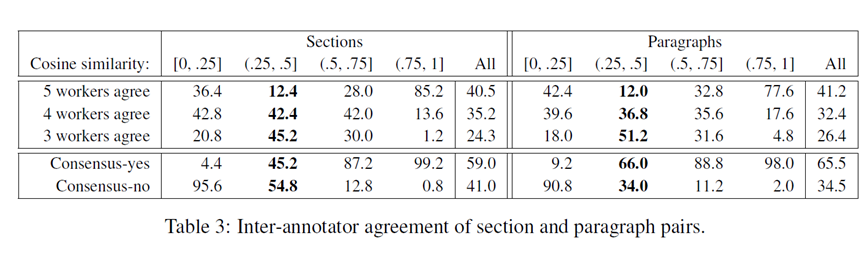
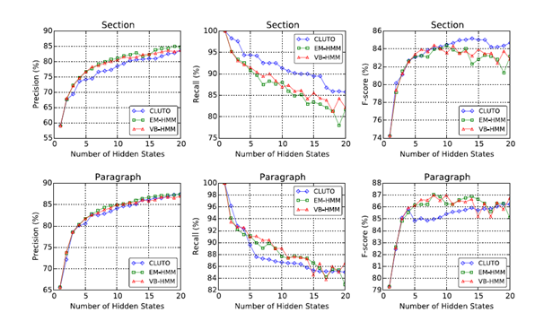

The Creation and Analysis of a Website Privacy Policy Corpus
-----------------------------------------------------------

Wilson et al. create a corpus of 115 privacy policy. They developed a policy secheme with ten data practice (First Party Collection/Use, Third Party Sharing/Collection, User Choice/Control, User Access, Edit, & Deletion, Data Retention, Data Security, Policy Change, Do Not Track, International & Specific Audiences, Other) formulated by domain experts. For a data practice, it will have many attributes. For example, for the data practice User Choice/Control, it have Choice Type, Choice Scope, Personal Information Type, Purpose and one optional attribute (User Type). Then skilled annotators used annotation tool which developed by authors to select data practice and its attributes. Besides that, they analysis the distribution of data practice and use logistic regression, SVM and HMM to predict privacy policy's structure. They split 'Other' into three categories(Introductory/Generic, Practice Not Covered, and Privacy Contact Information). If two or more annotators agreed that a segment have a category, then they labeled that segment with that category.They used a 12 length binary vector to represent a segment. For the *i* th element, 1 represent this segment have the *i* th data practice. Otherwise it is 0. The result shows that the SVM model have the best effect.

Towards Automatic Classification of Privacy Policy Text
-------------------------------------------------------

Based on Wilson et al.'s work, Liu et al. used Logistc Regression, SVM and CNN model to classify the privacy policy on segments and sentence level. In a similar way, they split 'Other' into three categories(Introductory/Generic, Practice Not Covered, and Privacy Contact Information). If two or more annotators agreed that a segment or a sentence have a category, then they labeled that segment with that category.They used a 12 length binary vector to represent a segment or a sentence. Similarly, For the *i th element, 1 represent this segment or sentence have the *i* th data practice. The best results show micro-F1 scores of 0.78 and 0.66 for segment and sentence classification.

A comprehensive keyword analysis of online privacy policies
-----------------------------------------------------------

Kaur et al. They collected privacy policies from different domain and countries.
They fist used 2000 policies that were collected by Massey, Eisenstein, Antón, and Swire (2013).  Then they collected 600 policies covering 11 different application domains from Alexa. They also collected financial and e-commerce related privacy policies from USA, Canada and Europe(German and UK). They define some sections(Collection, Sharing, Choice, Access, Data retention, Data security, Policy change, Do not track, Purpose) according to the FTC and OECD FIP practices as well as recent work of Guntamukkala et al. (2015) and Wilson et al. (2016). They first use Tokenization, Stop word removal and Stemming to pre-process these privacy policy. They fed into LDA with keywords annotated by Guntamukkala et al. (2015) and Wilson et al. (2016) for LDA to extract more keywords for each section. They also studied the use of ambiguous words in privacy policies. This list is taken from Guntamukkala et al. (2015) and Reidenberg, Bhatia, Breaux, and Norton (2016). They analyzed coverage of sections in 2000 privacy policies, USA, Canada and UK, different domain. They calculated the word frequency of ambiguous words in the 2000 privacy policy. The five most commonly used words were *may*, *certain*, *for example*, *except*, and *like*. the top three ambiguous words in USA, Canada, UK and German policies are *may* , *will*, and *can*. The top 5 ambiguous words in 11 different domains are *may*, *share*, *certain*, *like*, and *for example*. 

Then they analyze data protection regulation about UK, Canada, USA, Germany and different domains. For example, the UK restricts the retention of data, but few privacy policies mention relevant keywords. The UK does not recommend collecting *email*, *name*, and *addresss* information, but there are many privacy policies that mention these keywords. PIPEDA requires confirmation from the user before collecting user data. So Canada's privacy policy uses a lot of *consent* keywords. In addition, Canada uses a lot of *update* and *delete* keywords. This shows that users have the right to access their data. Compared with other countries, the *security* keyword is also the most used in the privacy policy of Canada. The emphasis is on data transparency. Therefore, the keyword *retention*, *retain* appears very frequently, but the frequency of *delete* and *update* is not high. Germany's privacy policy does not use the keywords *phone*, *share*, *retain*, *disclose* and *password*. The keywords *delete*, *access*, *email*, *update*, *retention*, and *notice* are rarely used. This may have a lot to do with the relevant German laws.

In healthcare domain, privacy often uses *name*, *age*, *address*. Most health care collects personal information. The *security policy numbers* and s*ocial security numbers*. However, the frequency of these keywords is not very high. In shopping domain, privacy policy often uses *payment* , *information*, *site analytics*, and *behavioral* *Tracking* these keywords, keywords like *name*, *email*, *address*, and *contact information* such as *phone number*, *mobile*, *location* are frequently used in e-commerce policies. In kids domain, privacy policy rarely collects *security*, *SSL*, *safeguard*, and *socket Layer* these keywords.

The above results are only part of the results of their analysis. This paper analyzes the privacy policies of different countries and different countries in detail, which can be used as a reference when writing privacy policies.

Analyzing Vocabulary Intersections of Expert Annotations and Topic Models for Data Practices in Privacy Policies
------------------------------------------------------------------------

In this paper, the author uses NMF to generate a topic of privacy policy, assuming that the topic model generated using the unsupervised method has a one to one mapping relationship with the categories proposed by legal experts in Wilson et al. They use the Logistic Regression model to extract the keywords for each data practice. After that, they use NMF to generate the topic, and corresponding to each topic, the corresponding keywords can be generated. Each category and topic can then be represented by the extracted keywords. They analyzed the relationship between topic and category by analyzing the Jaccard Similarity of topic and category keywords. Their results indicate a meaningful mapping between the topic model and the expert-defined categories. Unfortunately, there is no One to One mapping, mostly One to Many, Many to One or Many to May.

Extracting keyword and keyphrase from online privacy policies.
------------------------------------------------------------------------

Audich et al.[9] used RAKE, TextRank, AlchemyAPI, TF-IDF for keyword and key extraction on small data sets and large data sets, respectively, and compared them with manual extraction results. The small data set comes from 21 privacy policies on the most visited websites in Wikipedia. The big data set comes from 631 privacy policies in the Data Management and Privacy Governance Lab at the University of geulph. It was found that TF-IDF performed well on manual annotations on small datasets of 21 strategies, while AlchemyAPI performed slightly better on TF-IDF on \larger datasets. Due to the lack of standardized languages used in online privacy policies, algorithms that evaluate individual documents (TextRank, RAKE, AlchemyAPI) perform better than significant marginal algorithms that extract keywords from larger corpora (TF-IDF). Their results show that natural language processing techniques are still a challenging task for retrieving keywords and key phrases from legal and semi-legal documents

Automated analysis of privacy requirements for mobile apps
------------------------------------------------------------------

Zimmeck, Sebastian, et al. [4] propose a novel combination of machine learning (ML) and static analysis techniques to analyze apps' potential noncompliance with privacy requirements. They define privacy requirements as follows: Privacy Policy Requirements, Notice Policy Change (NPC), Notice Access,Edit, and Delete (NAED), Collection IDentifier (CID), Collection Location (CL), Collection Contact (CC), Sharing IDentifier (SID), Sharing Location (SL) and Sharing Contact (SC). They first analyze the privacy policy, they used support vector machines and logistic regression to classify privacy policies, then they analyzed apps, they determine the actual privacy practice of the application by statically analyzing the API code of the application. Finally they compare  policy analysis results to what apps actually do according to their code to determine the inconsistency.

They provide a tool that automatically analyzes the inconsistencies between Apps and their privacy policy descriptions. Their research law defines nine practice, namely privacy policy requirements, NPC, NAED, CID, CL, CC, SID, SL, SC. They crawled 17,991 apps from Google Play, of which 9295 apps have links to privacy policies. For each exercise, the keywords are extracted with tf-idf and Information Gain, and then the sentences containing the keywords are extracted and converted into unigram and bigram feature carriers. They used OPP-155 as a training set and classified the privacy policies of 9295 applications using SVM and LR models.

For the app, they use a static analysis method to determine what the app does by analyzing their api and permission. For the full app/policy set (n = 9,050) they found that 2,455 apps have one potential inconsistency, 2,460 have two, and only 1,461 adhere completely to their policy. Each app exhibits a mean of 1.83 (16,536/9,050) potential inconsistencies.

The Case for a GDPR-specific Annotated Dataset of Privacy Policies
---------------

This paper briefly introduces the importance of GDPR and GDPR. The authors are based on GDPR elements (Information on the company, Type of personal data, Purpose of processing, Storage Period, Transfer 3rd country, Source of personal data, Rights to withdraw, Automated decision making, Cookie policy) compares the existing dataset and proposes four considerations before the relevant data analysis, namely Impact of new elements, Impact of multi-linguality, Impact of domain shift due to The type of companies, Impact of domain shift due to adaptation to the GDPR.

A Step Towards Usable Privacy Policy:Automatic Alignment of Privacy Statements
-----------

They divided the 1010 privacy policy into sections according to the subtitle and break the sections by lines for generating paragraph. They randomly extracted 1000 document pairs to generate section pairs and paragraph pairs, and divided the pairs into 4 parts according to the cosine similarity interval([0, 0.25], (0.25, 0.5], (0.5, 0.75], (0.75, 1]). They let the crowdworkers judge whether these pairs describe the same issue. Each section/paragraph pair was judged by five crowdworkers and was rewarded $0.05.

They used **the hidden Markov model** to capture local transitions between topics, and used **Expectation-Maximization **(**EM**) and **variational Bayesian** (**VB**) **inference** as estimation procedures. They combined these two methods with **CLUTO** to do a set of comparative experiments. At the same time their results can play a similar role to the lower half of crowdworkers.

Quantifying the Effect of In-Domain DistributedWord Representations: A Study of Privacy Policies
---------------------------------------

Kumar et al.  used the 300,000 privacy policies to train the word embeddings. After that, They used the embeddings to convert the OPP-115 to the vectors. They used SVM, Feed-forward network, Deep Convolutional Model to classify the OPp-115 based on segements, and finally analyzed the result. They found the in-domain word embeddings improved the performance of the model.Comparing several models, they found that the classification effect of Feed-forward network is the best. They compared their experimental results with glove, and their experimental results are more representative of the meaning of some professional vocabulary in the privacy policy. For example, in their word embedding, party and privacy mean similar, but in glove, party and food are similar. The meaning. At the same time, they found that 300-dimensional embeddings are better than 100-dimensional effects. At the same time, they found that the training data for word embedding worked best after 20,000. Finally they showed a two-dimensional space display of their word embedding.