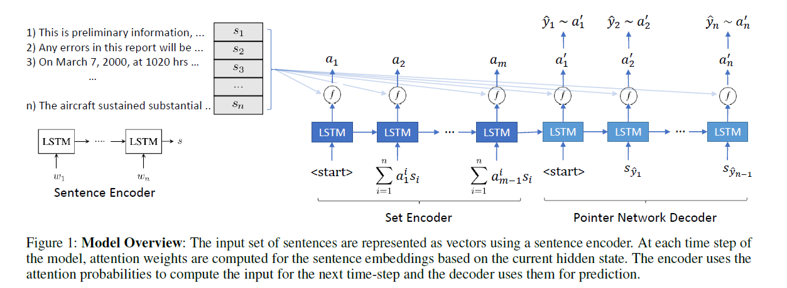
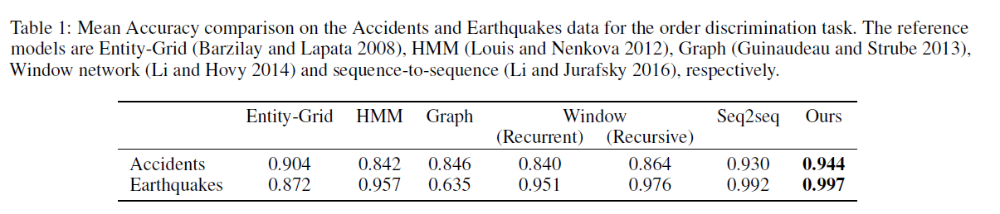
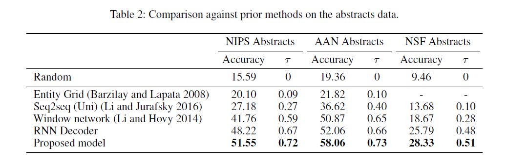
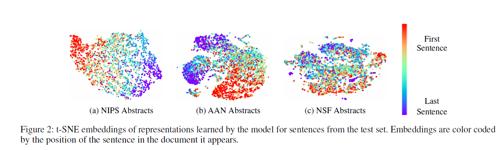
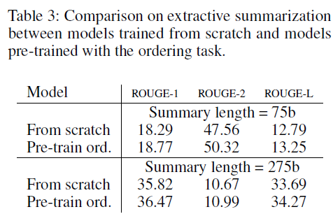
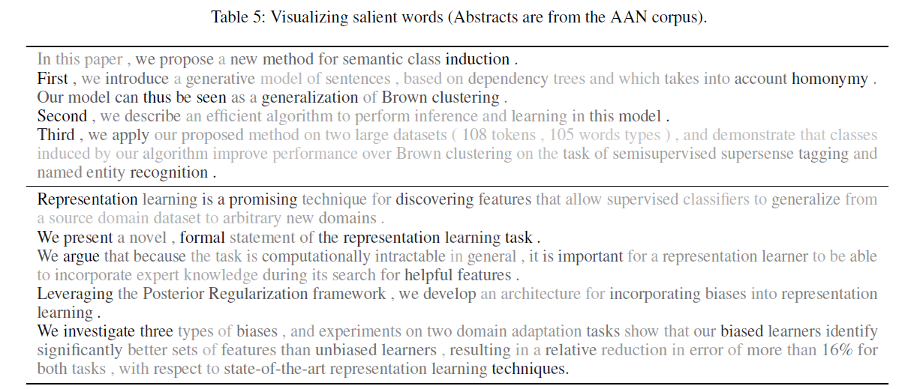

## Introduction

Lilleberg et al. [10] introduce a RNN-based set to sequence ordering model. They use pre-training 300-dimensional GloVe word embedding for word vector initialization, and use the Accidents and Earthquakes news reports data set for test and evaluation in order discrimination tasks. And  compared with Entity Grid, Seq2seq, Window network, RNN Decoder model and achieved outstanding results. In order to challenge the harder work, they collected the abstracts in NIPS, ACL, and NSF respectively, and the results showed that the models they proposed still achieved the best results. They found that the coherence score is well correlated with the quality of the abstract. They then evaluated the sentence representations of the models using them, and used their own ordering model, ordering model and BoW combined model, ordering model and Uni-ST combined mode, and the traditional surprised model and Uni-ST method. For comparison, excellent results have been achieved. Finally, their model can implicitly learn some distribution patterns of word.

## Approach

#### Encoder

$$
\begin{aligned} e_{\text { enc }}^{t, i} &=f\left(s_{i}, h_{\text { enc }}^{t}\right) ; i \in\{1, \ldots, n\} \\ a_{\text { enc }}^{t} &=\operatorname{Softmax}\left(e_{\text { enc }}^{t}\right) \\ s_{\text { att }}^{t} &=\sum_{i=1}^{n} a_{\text { enc }}^{t, i} s_{i} \\ h_{\text { enc }}^{t+1}, c_{\text { enc }}^{t+1} &=\operatorname{LSTM}\left(h_{\text { enc }}^{t}, c_{\text { enc }}^{t}, s_{\text { att }}^{t}\right) \end{aligned}
$$

#### Decoder

$$
\begin{aligned} h_{\mathrm{dec}}^{t}, c_{\mathrm{dec}}^{t} &=\operatorname{LSTM}\left(h_{\mathrm{dec}}^{t-1}, c_{\mathrm{dec}}^{t-1}, x^{t-1}\right) \\ e_{\mathrm{dec}}^{t, i} &=f\left(s_{i}, h_{\mathrm{dec}}^{t}\right) ; i \in\{1, \ldots, n\} \\ a_{\mathrm{dec}}^{t} &=\operatorname{Softmax}\left(e_{\mathrm{dec}}^{t}\right) \end{aligned}
$$

#### Score Function

- A single hidden layer feed-forward net
$$
f(s, h)=W^{\prime} \tanh (W[s ; h]+b)+b^{\prime}
$$
- A bilinear scoring function
$$
f(s, h)=s^{T}(W h+b)
$$

#### Coherence Score

$$
\sum_{i=1}^{k} \log p\left(S_{i}=s_{p_{i}} | S_{1, \ldots, i-1}=s_{p_{1}, \ldots, p_{i-1}}\right)
$$

#### Training Objective
$$
\max \sum_{x \in D} \sum_{t=1}^{|x|} \log p\left(x^{t} | x^{1}, \ldots, x^{t-1}\right)
$$
Sentence Ordering and Summarization

#### Order Discrimination

#### Sentence Ordering

##### Data set:
- NIPS Abstracts
- ACL Abstracts
- NSF Abstracts

##### Result

$$
\tau = 1-2 \cdot N /\left(\begin{array}{l}{n} \\ {2}\end{array}\right)
$$

#### Sentence Ordering and Summarization

The model select sentences from document sentences set as summary until predict the 'stop' word.
Train a model form scratch and a model that is pre-trained on the ordering task.

##### Learned Sentence Representations

#### Word Influence

The importance of word wi in correctly predicting $w_{i}$ as the next sentence is defined as $\left\|\frac{\partial e}{\partial w_{i}}\right\|$

